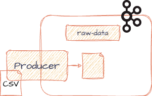

# Runner data producer

In this Java application we will use the Kafka Producer API to ingest data into a Kafka topic.
We will read a [CSV file](https://github.com/bakdata/kafka-lab/blob/main/data-producer/src/main/resources/data.csv)
and convert records to
[JSON](https://github.com/bakdata/kafka-lab/blob/main/common/src/main/java/com/bakdata/uni/RunnersRawData.java)
before ingesting.

## Resources

- [Streams bootstrap Kafka producer](https://github.com/bakdata/streams-bootstrap#kafka-producer)
- [JSON Schema Serializer and Deserializer](https://docs.confluent.io/platform/current/schema-registry/fundamentals/serdes-develop/serdes-json.html)
- [Reading CSV with Jackson](https://cowtowncoder.medium.com/reading-csv-with-jackson-c4e74a15ddc1)
